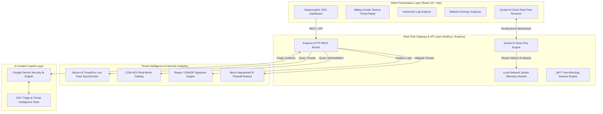

# 🛡️ Cyber Sentinel — Intelligent Threat Monitoring & Active Defense Platform

[](https://github.com/yushdhiman/Cyber-Sentinel-)
[](https://react.dev/)
[](https://nodejs.org/)
[](https://socket.io/)
[](https://threatfox.abuse.ch/)
[](LICENSE)

> **Enterprise-Grade Cybersecurity Operations Center (SOC) & Threat Intelligence Dashboard** featuring high-precision polar radar threat tracking, authentic threat feed ingestion (ThreatFox & CISA KEV), real-time host socket monitoring, heuristic SIEM log analysis, sandboxed malware inspection, and automated firewall mitigation.

---

## 🚀 Live Deployments

- 🌐 **Production Web Application (Vercel):** [https://cyber-sentinel-pwvj.vercel.app/](https://cyber-sentinel-pwvj.vercel.app/)
- ⚡ **Production API & Real-Time Engine (Render):** [https://cyber-sentinel-7xfn.onrender.com/](https://cyber-sentinel-7xfn.onrender.com/)

---

## 📋 Executive Abstract & Capstone Motivation

In modern Security Operations Centers (SOCs), analysts face overwhelming alert fatigue, fragmented monitoring utilities, and high mean-time-to-detect (MTTD). **Cyber Sentinel** was engineered as an all-in-one, single-pane-of-glass defense platform that combines:
1. **Continuous Host Telemetry** with native socket connection tracking.
2. **Polar Threat Radar Visualizer** mapping external threats into spatial zones with laser vector targeting.
3. **Automated Threat Intelligence Ingestion** against live feeds from CISA Known Exploited Vulnerabilities (KEV) and Abuse.ch ThreatFox IOCs.
4. **Heuristic SIEM Log Analytics** delivering instant signature and anomaly scoring for unauthorized intrusion attempts.
5. **Active Firewall Defense Subsystems** allowing one-click IP blacklisting, stateful rule inspection, and structured capstone audit generation.

---

## 🏗️ System Architecture



---

## 🌟 Key Innovations & Core Modules

### 1. Tactical Threat Radar System
- **8-Point Compass Azimuth Ring:** Dynamic compass rose displaying $000^\circ\text{ N}$, $045^\circ\text{ NE}$, $090^\circ\text{ E}$, $135^\circ\text{ SE}$, $180^\circ\text{ S}$, $225^\circ\text{ SW}$, $270^\circ\text{ W}$, $315^\circ\text{ NW}$ with continuous azimuth angle tracking.
- **Concentric Distance Graticules:** Four calibrated defensive perimeters:
  - `SUBNET (0–25km)` — Local host and loopback connections.
  - `GATEWAY (25–50km)` — Intranet routers and proxy relays.
  - `PERIMETER (50–75km)` — DMZ firewall boundaries.
  - `EXTERNAL WAN (75–100km)` — Public internet and botnet actors.
- **Target Lock Reticle & Laser Vector Line:** Selecting any detected blip instantly locks an animated targeting crosshair `[ + ]`, traces a vector line directly from the local Sentinel Core, and renders an interactive **Target Intelligence Card** showing:
  - Target IP & Copy Action
  - Threat Vector Classification (e.g. `HTTPS C2 Beacon`, `SQLi Exploit`)
  - Radial Bearing ($^\circ$), Estimated Range ($\text{km}$), and Round-Trip Time Latency ($\text{ms}$)
  - One-Click **"⚡ QUICK BLOCK IP"** firewall mitigation.
- **Dynamic Radar Controls:** Multi-stage Zoom (`1x`, `2x`, `4x`), Variable Sweep Speed (`FAST 2s`, `NORM 3.5s`, `DEEP 7s`), Severity Filtering (`CRITICAL`, `HIGH`, `MEDIUM`, `BLOCKED`), and Sonar Pulse Ping wave.

### 2. Live Threat Intelligence Feeds
- **Abuse.ch ThreatFox IOC Integration:** Loads and indexes hundreds of active Indicators of Compromise (C2 IP addresses, botnet controllers, payload hashes).
- **CISA KEV Catalog Synchronization:** Ingests official vulnerabilities from the Cybersecurity and Infrastructure Security Agency's Known Exploited Vulnerabilities catalog.

### 3. Rule-Based SIEM Log Analyzer
- **Multi-Vector Detection:** Automatically parses raw server logs (Apache, Nginx, Linux auth, SSH) to flag:
  - Brute-force threshold anomalies ($\ge 3$ failures/window).
  - SQL Injection signatures (`UNION SELECT`, `' OR '1'='1`, `SLEEP()`).
  - Cross-Site Scripting (`<script>`, `onerror=`, `javascript:`).
  - Remote Command Execution (`/etc/passwd`, `; cat /dev/`, `powershell -enc`).
- **Risk Scoring Algorithm:** Computes an aggregate risk factor ($0\text{–}100$) per IP address and tags threat severities based on frequency and payload weight.

### 4. Sandboxed Malware Analyzer
- **Static File Inspection:** Calculates SHA-256 digests and file entropy distribution to detect packed or encrypted executable headers.
- **Behavioral Indicators:** Extracts suspicious system APIs (`VirtualAlloc`, `RegSetValueEx`, `CreateRemoteThread`, `WSAStartup`) to generate a risk verdict before binary execution.

### 5. AI Incident Response Copilot
- Powered by Google Gemini with security-tailored prompt system instructions.
- Provides immediate remediation runbooks, CVE explainers, and firewall configuration syntax (iptables, UFW, Windows Netsh).

### 6. Capstone SOC Audit Exporter
- Generates a timestamped, structured **Capstone Incident & Security Audit Report** (`JSON`) with one click from the dashboard.
- Includes operational metrics, host telemetry, active firewall rules, and compliance control verifications.

---

## 📐 Mathematical & Spatial Coordinate Models

### Polar-to-Cartesian Radar Projection
Each incoming threat packet is deterministically mapped to polar coordinates $(\theta, r)$ using an IP hash function, then transformed to Cartesian coordinates $(x, y)$ on the SVG radar graticule:

$$\theta = \left(\sum_{i=1}^{4} \text{oct}_i \cdot 31^{4-i}\right) \pmod{360^\circ}$$

$$r_{\text{scaled}} = \min\left(88\%, \max\left(12\%, r_{\text{base}} \times Z\right)\right)$$

$$x = 50\% + \left(\frac{r_{\text{scaled}}}{2}\right) \cos\left(\theta \cdot \frac{\pi}{180}\right)$$

$$y = 50\% + \left(\frac{r_{\text{scaled}}}{2}\right) \sin\left(\theta \cdot \frac{\pi}{180}\right)$$

*Where $Z \in \{1.0, 1.8, 2.8\}$ represents the active Zoom Factor.*

---

## 🔌 API & Event Specification

### REST Endpoints

| Endpoint | Method | Purpose | Auth |
|---|---|---|---|
| `/api/health` | `GET` | Health check, server uptime, WebSocket discovery URL | Public |
| `/api/threats` | `GET` | Paginated ThreatFox IOCs and CISA KEV catalog | Non-blocking |
| `/api/threats/stats` | `GET` | High-level threat count and severity distributions | Non-blocking |
| `/api/logs/analyze` | `POST` | Ingests raw text logs and returns heuristic threat breakdown | Non-blocking |
| `/api/protection/block` | `POST` | Appends IP address to the active local firewall blacklist | Non-blocking |
| `/api/sandbox/analyze` | `POST` | Inspects uploaded payload for entropy and malicious imports | Non-blocking |
| `/api/chatbot/message` | `POST` | Sends security query to AI Copilot engine | Non-blocking |

### Real-Time WebSocket Events

| Event Name | Direction | Interval | Payload Description |
|---|---|---|---|
| `system:metrics` | Server $\to$ Client | $2\text{s}$ | CPU usage, RAM utilization, threat index, uptime |
| `attack:event` | Server $\to$ Client | $3\text{–}7\text{s}$ | Active network packet, IP, threat vector, severity, status |
| `attack:history` | Server $\to$ Client | On Connect | Initial batch of historical attack logs |
| `timeline:update`| Server $\to$ Client | $30\text{s}$ | 24-hour attack volume histogram |
| `custom:ping` | Bi-directional | $3\text{s}$ | Measures round-trip network latency in milliseconds |

---

## 💻 Local Setup & Installation

### Prerequisites
- **Node.js** 18.0.0 or higher
- **npm** 9.0.0 or higher

### Quick Start (Single Command)

```bash
# 1. Clone the repository
git clone https://github.com/yushdhiman/Cyber-Sentinel-.git
cd Cyber-Sentinel--main

# 2. Install all dependencies (Root, Backend, Frontend)
npm install
cd backend && npm install && cd ../frontend && npm install && cd ..

# 3. Start both Backend & Frontend concurrently
npm run dev
```

- **Frontend Application:** `http://localhost:5173/`
- **Backend API & WebSocket Server:** `http://localhost:10000/`

---

## 🎓 Capstone Defense Presentation Walkthrough

When presenting this project for an evaluation, viva, or interview, follow this **5-minute demonstration script**:

1. **Orientation (Minute 1):** Open the [Live Dashboard](http://localhost:5173/). Point out the real-time telemetry badge (`SOC ENGINE: LIVE SYNC`) and the four KPI cards tracking Threat Score, Velocity (APM), Blocked Mitigations, and Host CPU/RAM.
2. **Tactical Threat Radar (Minute 2):** 
   - Highlight the 8-point compass dial, concentric distance graticules, and the real-time azimuth tracking.
   - Switch zoom levels (`1x` $\to$ `2x` $\to$ `4x`) and sweep speeds (`FAST` $\to$ `DEEP`).
   - Click the **📡 PULSE** button to demonstrate the radar shockwave animation.
   - Click any threat blip on the radar to demonstrate **Target Lock**, the laser vector line, and the **Target Intelligence HUD**.
3. **Automated Mitigation (Minute 3):** Click **⚡ QUICK BLOCK IP** directly from the radar HUD. Show the instant toast confirmation and observe the blocked threat counter increment.
4. **Deep Log Inspection (Minute 4):** Navigate to the **Log Analyzer**, load a sample SSH brute-force or SQL injection log, and run analysis to show instant regex signature detection and IP risk scoring.
5. **Report Generation (Minute 5):** Return to the Dashboard and click **📄 EXPORT CAPSTONE AUDIT REPORT**. Open the downloaded JSON file to show the formal cybersecurity incident audit artifact.

---

## 👨‍💻 Author & Project Attribution

- **Lead Developer & Architect:** [Ayush Dhiman](https://github.com/yushdhiman)
- **Repository:** [https://github.com/yushdhiman/Cyber-Sentinel-](https://github.com/yushdhiman/Cyber-Sentinel-)
- **Academic Focus:** Full-Stack Cybersecurity Operations Center (SOC) Architecture & Reactive Defense Automation

---

## 📄 License

Distributed under the **MIT License**. See `LICENSE` for more information.
